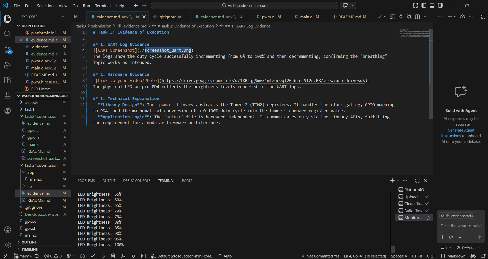

# Task 3: Evidence of Execution

## 1. UART Log Evidence

The logs show the duty cycle successfully incrementing from 0% to 100% and then decrementing, confirming the "breathing" logic works as intended.

## 2. Hardware Evidence
[[Link to your Video/Photo](https://drive.google.com/file/d/1XBLjgSmvx1mlzhc9qT2Gj6LrrSl2rzB8/view?usp=drivesdk)]
The physical LED on pin PD4 reflects the brightness levels reported in the UART logs.

## 3. Technical Explanation
- **Library Design**: The `pwm.c` library abstracts the Timer 2 (TIM2) registers. It handles the clock gating, GPIO mapping to PD4, and the mathematical conversion of a 0-100% duty cycle into the timer's compare register value.
- **Application Logic**: The `main.c` file is hardware-independent. It communicates only via the library APIs, fulfilling the requirement for a modular firmware architecture.