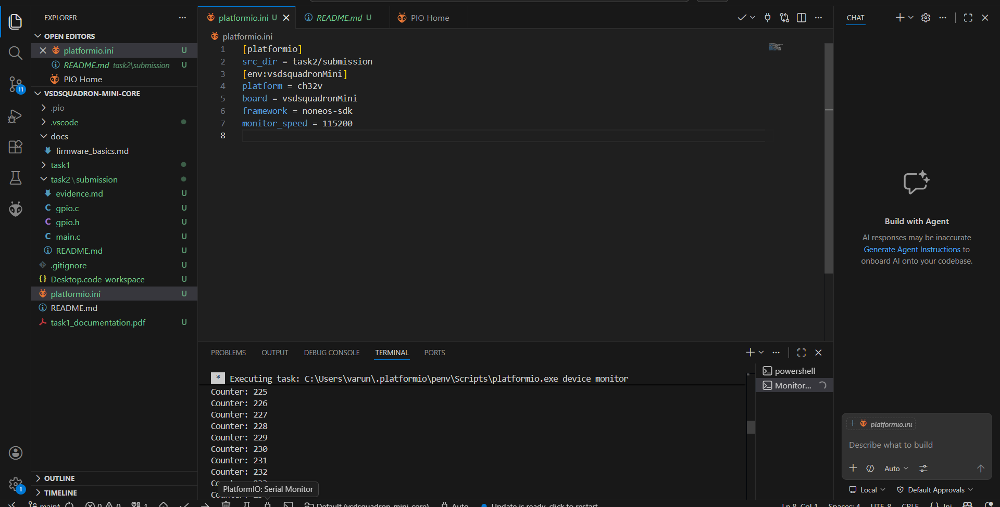

 Task 2 Evidence: Hardware Validation

## UART Heartbeat Log
The following terminal output confirms that the RISC-V core is executing the firmware correctly and maintaining a stable UART connection at 115200 baud.

**Counter Achievement:** 230+ cycles completed successfully.

## Physical Hardware Toggling
The video below demonstrates the physical board in operation, showing the startup sequence and the PD4 pin toggling in synchronization with the UART logs.

* **Physical Pin:** PD4
* **Toggling Frequency:** 1Hz (1000ms delay)

**[Click here to view the Video Evidence](https://drive.google.com/file/d/1liSbK1U0-GCBSF8P3PPXlYa_wu6bIbR1/view?usp=drivesdk)**
